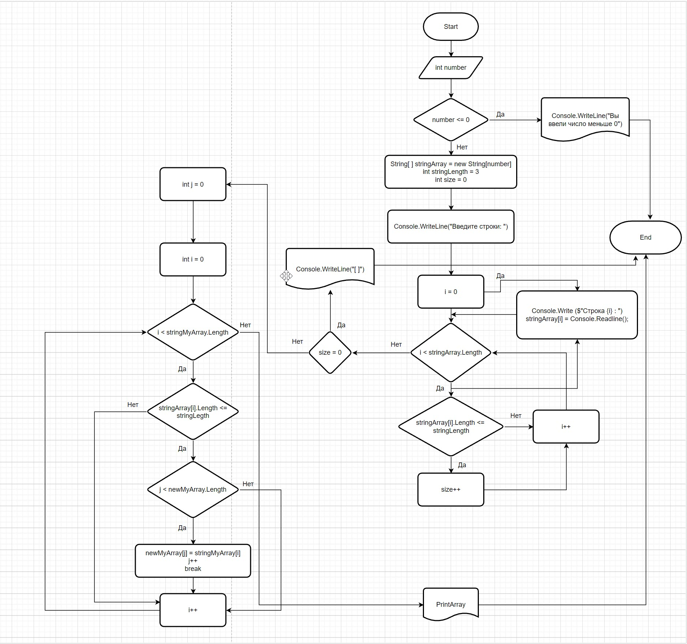

# Итоговая проверочная работа
## Этапы решения задачи  
### 1. Создал репозиторий на GitHub
### 2. Составил блок-схему решения задачи.
### 3. Описание решения
* задал переменную  **_int number_** путём ввода через консоль, которая задаёт размер массива строк;
* сделал проверку значения переменной **_number_**, чтобы задача выполнялась только при условии **_number > 0_** ;
* объявил и проинициализировал массив строк, размером **_number_** ;
* ввёл новую переменную **_int size_**, которая будет задавать размер массива строк, значения элементов которого меньше либо равна 3;
* оформил в виде цикла ввод элементов массива строк через консоль;
* ввёл проверку значения переменной **_size_** . В случае равенства значения переменной нулю, т.е. отсутствия элементов массива, значения которых меньше либо равно 3, вывод в консоль пустых строк массива, согласно условия задачи;
* оформил отдельным методом создание нового массива строк, значения элементов которого меньше либо равны 3;
* оформил отдельным методом вывод на печать нового массива строк; 

